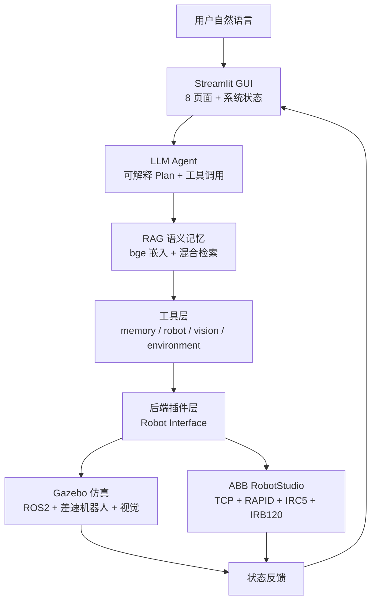

# AI-Robot-Demo

基于大语言模型智能体（LLM Agent）的工业机器人任务规划系统。

> 本科科研项目档案：本项目用于毕业论文验证与科研展示，GitHub 公开但定位为
> “科研过程记录”，而非普通开源软件推广。

[English README](README_en.md) · [License](LICENSE) · [Contribute](CONTRIBUTING.md)

---

## 项目简介

传统工业机器人依赖固定程序与人工示教，难以理解自然语言任务。本项目探索用
**大语言模型智能体（LLM Agent）** 提升机器人的任务理解与规划能力，构建了从
“用户自然语言”到“机器人物理执行”的完整闭环：

```
用户自然语言输入
       ↓
    LLM Agent（任务理解 + 可解释规划）
       ↓
    RAG 知识增强（语义记忆检索）
       ↓
    任务规划（结构化 JSON 动作契约）
       ↓
    机器人执行（ROS2/Gazebo 仿真 · ABB RobotStudio 真实联调）
```

核心设计思想：**规划与执行解耦、后端插件化、过程可解释**。
AI 不输出黑盒思考链，而是输出结构化计划（任务分析 / 目标 / 执行步骤 /
当前状态）与逐步骤执行结果，便于科研演示与论文实验。

## 项目背景

工业机器人场景中，让 LLM 直接控制机器人存在三大问题，本项目逐一解决：

1. **输出不可控**：LLM 自由文本无法直接执行 → 用 JSON 动作契约约束
   （规划层输出与执行层完全解耦）；
2. **没有记忆**：LLM 无状态 → 引入 SQLite 长期记忆 + RAG 语义检索
   （bge-small-zh 向量嵌入 + 混合检索）；
3. **与机器人系统脱节**：LLM 不会调用机器人 API → 引入 Agent 工具化架构
   （memory / robot / vision / environment 四工具），并通过标准后端接口
   对接 ROS2/Gazebo 与 ABB RobotStudio。

## 技术架构



分层设计（强调软件工程思想）：

- **交互层**：Streamlit GUI（任务对话 / 工作台 / 记忆 / 视觉 / 机器人状态 +
  论文展示层：实验分析 / 任务回放 / 系统信息）
- **智能体层**：可解释规划、工具调用、会话上下文、指代消解
- **语义记忆层**：bge-small-zh 向量嵌入 + SQLite 向量表 + 混合检索
- **后端插件层**：统一 `RobotTool → Backend` 接口，Local / Gazebo / RobotStudio
  三种后端可插拔切换
- **通信/仿真层**：ROS2 话题通信 + Gazebo 物理仿真；ABB RobotStudio TCP +
  RAPID SocketServer 真实虚拟控制器联调

## 技术栈

| 技术 | 用途 |
| --- | --- |
| Python 3.12 | 全栈开发语言（Windows + WSL） |
| DeepSeek LLM API | 自然语言任务理解与规划 |
| Agent（Planner/Executor/Tool） | 可解释计划 + 工具调用 |
| RAG | 语义记忆检索（bge-small-zh + 混合检索） |
| ROS2 Humble | 机器人节点通信 |
| Gazebo 11 | 机器人物理仿真与视觉感知 |
| ABB RobotStudio 6.08.01 | 工业机器人虚拟控制器 |
| RobotWare 6.08.1040 / RAPID | 控制器运动程序与 Socket 通信 |
| TCP Socket | Python ↔ RAPID 控制链路 |
| Streamlit | 图形化交互界面 |
| SQLite + numpy | 记忆持久化与向量检索 |
| OpenCV | 视觉颜色识别 |

## 当前成果

### 版本历程（V1 ~ V6.3）

| 版本 | 内容 | 状态 |
| --- | --- | --- |
| V1 | LLM 任务规划（DeepSeek + JSON 动作契约 + Mock 降级） | ✅ |
| V2 | Memory 记忆系统（SQLite 环境/物体/用户知识） | ✅ |
| V3 | ROS2 节点通信（ai_brain / robot_controller / vision_node） | ✅ |
| V4 | Gazebo 仿真（差速机器人 + 相机视觉 + 物理导航） | ✅ |
| V5.1 | Streamlit GUI（对话/工作台/记忆/视觉/机器人状态） | ✅ |
| V5.2 | Agent 工具调用与可解释规划（四工具） | ✅ |
| V5.3 | RAG 语义记忆（bge 嵌入 + 混合检索） | ✅ |
| V5.4 | Agent 自动评测（成功率/响应时间/RAG 召回率） | ✅ |
| V6.0 | RobotStudio 后端（Mock + Backend 插件架构） | ✅ |
| V6.1 | ABB RobotStudio 真实联调（TCP + RAPID + IRC5） | ✅ |
| V6.2 | 真实 MoveL + CJointT 真值 + GETPOSE + 实验基准 + 论文稳定化 | ✅ |
| V6.3 | 论文展示层（实验数据看板 / 任务回放 / 系统信息页） | ✅ |

### ABB RobotStudio 真实联调

环境：RobotStudio 6.08.01 · RobotWare 6.08.1040 · ABB IRB120 · IRC5 虚拟控制器

```
Python Agent
    ↓ TCP Socket (127.0.0.1:30000)
RAPID SocketServer（socket_main）
    ↓
IRC5 虚拟控制器（MoveAbsJ / MoveL）
    ↓
ABB IRB120 机器人执行
```

支持命令：`HOME` / `MOVEJ` / `MOVEL`（真实直线运动） / `GETPOS` / `GETPOSE` /
`STATUS`（CJointT 实测关节真值）。

实测结果（2026-08-04）：

| 项目 | 结果 |
| --- | --- |
| V6.1 TCP 闭环测试 | 15/15 成功率 100%（GETPOS ~145ms / HOME ~46ms / MOVEJ ~172ms） |
| V6.2 真实直线运动 | MOVEL 100mm 位移、姿态保持，271ms，返回实测关节 |
| 位姿反馈 | GETPOSE 与官方 DH 正运动学误差 <1mm |
| 实验基准 | 8 任务 × 5 轮 = 40/40 成功率 100%，平均响应 0.54s，RAG 召回 100% |
| 稳定性 | 10 次断连重连正常、330s 空闲存活（WAIT_MAX）、40 连压测通过 |

### 实验与论文

- 实验设计：[docs/thesis/experiment_plan.md](docs/thesis/experiment_plan.md)
- 开发记录：[docs/thesis/development_log.md](docs/thesis/development_log.md)
- 系统设计：[docs/system_design.md](docs/system_design.md)
- 系统架构：[docs/architecture.md](docs/architecture.md)
- 统一实验日志：`experiments/results/runtime_logs.json`（Agent 自动记录）
- 论文实验脚本：[experiments/thesis_experiments.py](experiments/thesis_experiments.py)

> 说明：毕业论文全文、答辩材料与软件著作权登记材料属于私有成果，
> 不收录于本公开仓库（存放于仓库外私有目录）。

## 项目结构

```
AI-Robot-Demo
├── agent/            # Agent 层（Planner / Executor / Tools / RAG）
├── robotstudio/      # ABB RobotStudio 模块（TCP 客户端 / RAPID / 测试）
├── ros2_ws/          # ROS2 + Gazebo 仿真（WSL）
├── gui/              # Streamlit 图形界面
│   └── panels/       #   论文展示层面板（实验分析 / 任务回放 / 系统信息）
├── experiments/      # 实验评测（任务集 / 基准脚本 / 日志 / 结果 / 图表）
│   ├── tasklog/      #   统一实验日志系统
│   ├── results/      #   实验数据（CSV / JSON / 报告）
│   ├── logs/         #   实验过程日志
│   └── figures/      #   实验图表
├── docs/
│   ├── thesis/       # 公开部分：实验设计 / 开发记录（论文全文与答辩材料为私有）
│   ├── system_design.md / architecture.md  # 系统设计与架构
│   └── ...           # 版本文档与学习记录
├── 学习记录.md       # 开发过程完整记录
└── README.md
```

## 快速开始

推荐方式：使用官方启动器一键启动（打开 V1/V2 演示、ROS2 仿真、任务终端
与 GUI 四个窗口，并自动打开浏览器）：

```powershell
.\AI_Robot_Demo_Launcher.ps1
```

需要后台静默启动（不弹窗口）时：

```powershell
.\AI_Robot_Demo_Launcher.ps1 -Background
```

手动启动：

```bash
# 1. 安装依赖（Windows）
pip install -r requirements.txt

# 2. 配置 DeepSeek Key（.env）
cp .env.example .env

# 3. 本地模式运行（V1/V2）
python main.py

# 4. GUI（RobotStudio / Gazebo 模式）
python -m streamlit run gui/app.py

# 5. RobotStudio 真实联调（需 RobotStudio 控制器运行中）
python robotstudio/robotstudio_real_connection_test.py --real
python robotstudio/manual_test_client.py --real

# 6. 论文实验
python experiments/robotstudio_benchmark.py --backend real --rounds 5
python experiments/thesis_experiments.py --experiment all --rounds 5
```

## 仓库说明

- 本仓库为**公开科研项目展示**：展示代码、架构与实验能力；
- 不上传：毕业论文全文、答辩材料、软著登记材料、API 密钥（`.env`）、
  模型文件与大体积数据（私有材料存放于仓库外 `AI-Robot-Demo-private/`）；
- 版本标签：`v4.0-gazebo` `v5.1-gui` `v5.2-agent` `v5.3-rag` `v5.4-evaluation`
  `v6.0-robotstudio` `v6.1-abb-simulation` `v6.2-movel-cjoint` `v6.2-thesis-stable`
