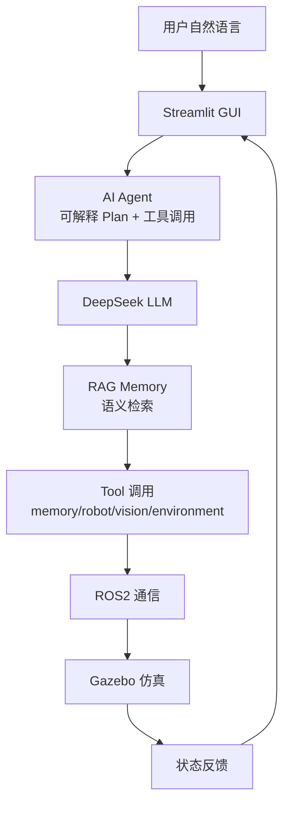

# AI Robot Agent System

基于大语言模型的机器人智能体任务规划系统：
自然语言 → AI Agent 可解释规划 → 工具调用 → ROS2 通信 → Gazebo 仿真执行 → 状态反馈。

## 项目介绍

本项目是一个从零搭建的 **LLM + Agent + RAG + 机器人仿真** 完整闭环系统。
用户用中文下达任务（如"把红色零件移动到检测区"），系统通过 DeepSeek 理解意图、
生成可解释的任务计划（任务分析 / 目标 / 执行步骤 / 当前状态），调用
记忆 / 机器人 / 视觉 / 环境四类工具，经 ROS2 话题驱动 Gazebo 仿真机器人
物理执行，并把结果实时反馈到 Streamlit 图形界面。

系统设计强调 **可观测性与可解释性**：AI 不输出黑盒思考链，而是输出结构化
计划与逐步骤执行结果，适合科研演示、本科毕设与后续论文实验。

## 项目背景

大语言模型展现出强大的自然语言理解能力，但直接让 LLM 控制机器人存在
三大问题：

1. **输出不可控**：LLM 自由文本无法直接执行 → 用 JSON 动作契约约束
2. **没有记忆**：LLM 无状态 → 引入 SQLite 长期记忆与 RAG 语义检索
3. **与机器人系统脱节**：LLM 不会调用机器人 API → 引入 Agent 工具化
   架构与 ROS2 标准通信

本项目用最小可行闭环逐一解决上述问题，并持续向科研深度演进。

## 系统架构



分层设计：

- **交互层**：Streamlit GUI（对话 / 工作台 / 记忆 / 视觉 / 机器人状态）
- **智能体层**：可解释规划、工具调用、会话上下文、指代消解
- **语义记忆层**：bge-small-zh 向量嵌入 + SQLite 向量表 + 混合检索
- **通信层**：ROS2 节点与话题（大脑 / 控制器 / 视觉）
- **仿真层**：Gazebo 差速机器人、相机、物理导航

详细文档见 [docs/](docs/)：架构、系统设计、Agent 设计、RAG 设计、
ROS2 设计、Gazebo 设计、实验记录、版本历史、研究介绍、学习总结。

## 技术栈

| 技术 | 用途 |
| --- | --- |
| Python | 全栈开发语言（Windows 3.12 / WSL 3.10） |
| DeepSeek / LLM | 自然语言任务理解与规划（deepseek-chat） |
| Agent | 可解释计划 + 工具调用架构 |
| RAG | 语义记忆检索（bge-small-zh + 混合检索） |
| ROS2 Humble | 机器人节点通信（话题模型） |
| Gazebo 11 | 机器人物理仿真与视觉感知 |
| Streamlit | 图形化交互界面 |
| SQLite | 记忆持久化与向量存储 |
| OpenCV | 视觉颜色识别 |

## 已实现功能

- 自然语言任务 → 结构化 JSON 动作（DeepSeek 真实模式 / Mock 离线模式）
- SQLite 长期记忆（环境 / 物体 / 用户知识三类，跨会话持久化）
- ROS2 节点化 AI 大脑与机器人控制器
- Gazebo 仿真：差速机器人物理导航 + 相机视觉感知
- Streamlit GUI：任务对话 / 工作台 / 记忆 / 视觉 / 机器人状态
- Agent 可解释规划：任务分析 / 目标 / 执行步骤 / 当前状态
- 四工具调用：memory / robot / vision / environment
- RAG 语义记忆：语义相近问题正确召回（"那个红色东西在哪里" → 红色零件）
- 一键启动：Windows Terminal 4 标签页（V1/V2 + ROS2 + 任务终端 + GUI）

## 项目版本演进

| 版本 | 内容 | 状态 |
| --- | --- | --- |
| V1 | LLM任务规划（DeepSeek + JSON） | ✅ |
| V2 | Memory记忆系统（SQLite） | ✅ |
| V3 | ROS2机器人通信 | ✅ |
| V4 | Gazebo仿真（视觉 + 导航） | ✅ |
| V5.1 | Streamlit GUI图形界面 | ✅ |
| V5.2 | Agent任务规划能力增强 | ✅ |
| V5.3 | RAG语义记忆系统 | ✅ |

Git Tag：`v4.0-gazebo` → `v5.1-gui` → `v5.2-agent` →（`v5.3-rag`）

## 运行方式

### 一键启动（推荐）

双击桌面 **AI机器人Demo全家桶**，Windows Terminal 打开 4 个标签页：

1. **V1/V2 AI机器人Demo**：Windows 单机演示
2. **V3/V4 ROS2仿真系统**：Gazebo 仿真（不要输入）
3. **任务终端**：命令行测试入口
4. **V5.1 GUI**：Streamlit 图形界面（浏览器自动打开 localhost:8501）

### 手动启动

```bash
# WSL Ubuntu 内
source /opt/ros/humble/setup.bash
source ~/ros2_ws/install/setup.bash
ros2 launch ai_robot demo_v4.launch.py        # 仿真系统

# 另一终端
python3 -m streamlit run gui/app.py            # GUI
ros2 run ai_robot task_cli                     # 命令行终端
```

### 环境要求

- Windows：Python 3.12、streamlit、openai
- WSL2 Ubuntu 22.04：ROS2 Humble、Gazebo 11、OpenCV、
  sentence-transformers、torch（CPU）、numpy 1.26.4（勿升级到 2.x）
- DeepSeek API Key 配置在 `.env`

## 未来计划

- RAG 与 Agent / GUI 完整集成
- Agent 评测体系（成功率 / 响应时间 / 召回率）
- MoveIt 机械臂抓取（V6）
- 真实机器人 / ABB RobotStudio 对接
- 工业智能制造应用（V7）
