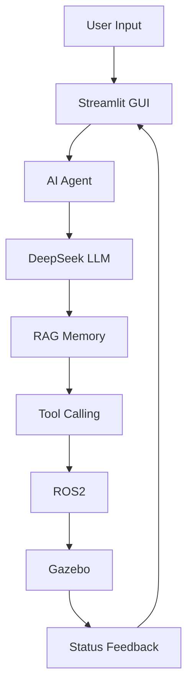

# AI Robot Agent System

A robot task-planning system powered by large language models:
natural language → interpretable Agent planning → tool calling → ROS2
communication → Gazebo simulation execution → status feedback.

## Introduction

This project is an end-to-end **LLM + Agent + RAG + Robot Simulation** system.
Users issue Chinese natural-language tasks (e.g., "Move the red part to the
inspection area"). The system understands intent via DeepSeek, generates an
interpretable plan (task analysis / goal / execution steps / current state),
invokes memory / robot / vision / environment tools, drives a Gazebo robot
through ROS2 topics, and feeds status back to a Streamlit UI.

The design emphasizes **observability and interpretability**: the AI exposes
structured plans and per-step results instead of a black-box chain of thought.

## Architecture



## Tech Stack

| Tech | Purpose |
| --- | --- |
| Python | Core language (3.12 on Windows / 3.10 on WSL) |
| DeepSeek / LLM | Natural-language understanding and planning |
| Agent | Interpretable planning + tool calling |
| RAG | Semantic memory retrieval (bge-small-zh + hybrid search) |
| ROS2 Humble | Robot node communication |
| Gazebo 11 | Physics simulation and vision |
| Streamlit | GUI |
| SQLite | Persistence and vector storage |
| OpenCV | Color-based vision |

## Features

- Natural language → structured JSON actions (DeepSeek / offline Mock)
- SQLite long-term memory (environment / object / user knowledge)
- ROS2 node architecture (brain / controller / vision)
- Gazebo simulation: differential robot navigation + camera vision
- Streamlit GUI: chat / workspace / memory / vision / robot status
- Interpretable Agent plan (task analysis / goal / steps / current state)
- Four tools: memory / robot / vision / environment
- RAG semantic recall ("Where is that red thing?" → red part)
- One-click launcher: Windows Terminal with 4 tabs

## Version History

| Version | Content | Status |
| --- | --- | --- |
| V1 | LLM task planning | ✅ |
| V2 | Memory system (SQLite) | ✅ |
| V3 | ROS2 robot framework | ✅ |
| V4 | Gazebo simulation | ✅ |
| V5.1 | Streamlit GUI | ✅ |
| V5.2 | Agent planning | ✅ |
| V5.3 | RAG semantic memory | ✅ |
| V5.4 | Evaluation framework | ✅ |

Git tags: `v4.0-gazebo` → `v5.1-gui` → `v5.2-agent` → `v5.3-rag` → `v5.4-evaluation`

## Getting Started

### One-click

Run the official launcher in PowerShell — it opens 4 tabs (V1/V2 demo,
ROS2/Gazebo, task CLI, Streamlit GUI) and auto-opens the browser:

```powershell
.\AI_Robot_Demo_Launcher.ps1
```

For background silent start (no windows):

```powershell
.\AI_Robot_Demo_Launcher.ps1 -Background
```

### Manual

```bash
# In WSL Ubuntu
source /opt/ros/humble/setup.bash
source ~/ros2_ws/install/setup.bash
ros2 launch ai_robot demo_v4.launch.py

# Another terminal
python3 -m streamlit run gui/app.py
```

### Evaluation

```bash
python3 experiments/evaluate.py --rounds 5
```

See [docs/](docs/) for architecture, designs, experiments, and research notes.

## Roadmap

- MoveIt robotic arm grasping (V6)
- Real robot / ABB RobotStudio integration
- Industrial manufacturing applications (V7)

## License

MIT — see [LICENSE](LICENSE).
