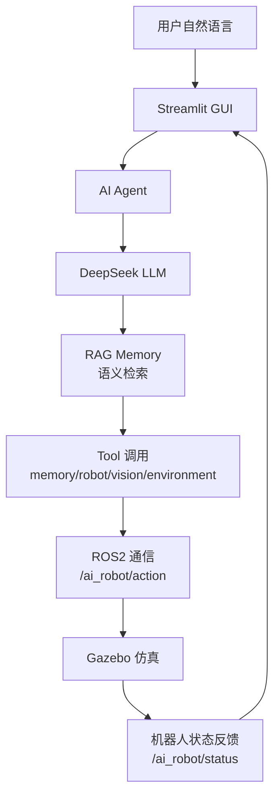

# 系统架构说明

## 1. 功能介绍

本项目是一个**基于大语言模型的机器人智能体任务规划系统**：用户用自然语言下达任务，
系统通过 AI Agent 理解意图、生成可解释的任务计划，调用记忆/视觉/环境/机器人四类工具，
最终经 ROS2 通信驱动 Gazebo 仿真机器人执行，并把状态反馈回界面。

系统由六个层次组成：

1. **交互层**：Streamlit GUI（任务对话 / 工作台 / 记忆 / 视觉 / 机器人状态）
2. **Agent 层**：任务理解 → 可解释 Plan（任务分析/目标/执行步骤/当前状态）→ 工具调用
3. **LLM 层**：DeepSeek（deepseek-chat，OpenAI 兼容接口）
4. **记忆层**：SQLite 长期记忆 + RAG 语义检索（bge-small-zh 向量）
5. **通信层**：ROS2 话题（/ai_robot/task、/action、/status、/vision）
6. **仿真层**：Gazebo（差速机器人 + 相机 + 彩色零件）

## 2. 技术选择原因

| 层次 | 选型 | 原因 |
| --- | --- | --- |
| 交互 | Streamlit | Python 原生、开发快、适合科研演示与快速迭代 |
| 大脑 | DeepSeek API | 中文理解好、JSON 输出稳定、成本低 |
| Agent | 自研 agent 层 | 可解释 Plan + 工具化，满足科研可观测性需求 |
| 记忆 | SQLite + bge-small-zh | 轻量持久化 + 中文语义向量，无需外部数据库服务 |
| 通信 | ROS2 Humble | 机器人领域标准中间件，话题模型天然适配 |
| 仿真 | Gazebo 11 | 与 ROS2 集成成熟，支持物理与传感器仿真 |

## 3. 数据流程



详细流程：

```
用户输入
  → Agent.handle(task)
     1. 指代消解 + 会话上下文更新（context）
     2. RAG 语义检索相关记忆（向量 top-k + 关键词兜底）
     3. DeepSeek 生成可解释 Plan（task_analysis/goal/steps/current_state）
     4. Executor 按步骤调用工具：
        - memory_tool      → SQLite 记忆读写
        - vision_tool      → /ai_robot/vision 视觉识别结果
        - environment_tool → 工作台/工位/里程计
        - robot_tool       → /ai_robot/action → robot_controller → Gazebo
     5. 汇总结果 + 更新当前状态
  → GUI 展示 Plan 与执行结果
```

## 4. 当前实现状态

- V1-V4（LLM 规划 / Memory / ROS2 / Gazebo）：已完成并实测通过
- V5.1（GUI）：已完成，5 个标签页，中文界面
- V5.2（Agent）：已完成，四工具 + 可解释 Plan
- V5.3（RAG）：基础模块已完成（embedder / vector_store / retriever），
  已通过「那个红色东西在哪里 → 红色零件」语义召回测试；与 Agent/GUI 的完整集成进行中
- V6（真实机械臂）、V7（工业应用）：规划中

## 5. 未来扩展方向

- RAG 与 Agent 完整集成（planner 上下文注入语义记忆）
- 多轮对话增强（更完善的指代消解与对话状态管理）
- Agent 评测体系（任务成功率 / 规划质量 / 响应时间）
- 真实机械臂接入（MoveIt / ABB RobotStudio）
- 视觉升级（YOLO 目标检测替换 HSV 颜色识别）
